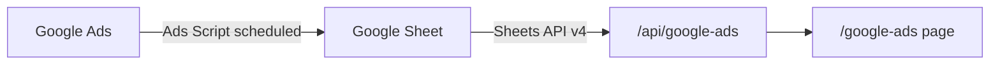

# PLAN: Google Ads via Google Sheets Bridge

## Goal

Thêm menu **"Google Ads"** vào Marketing Hub để hiển thị dữ liệu Google Ads, sử dụng Google Sheets làm trung gian (bridge). Google Ads Script sẽ tự động export data → Google Sheet → Marketing Hub đọc qua Sheets API.

---

## Architecture



---

## Phase 1 — Backend API

### [NEW] `apps/web/src/app/api/google-ads/route.ts`

- Fetch data từ Google Sheets via `googleapis` npm package
- Env vars: `GOOGLE_SHEETS_ID`, `GOOGLE_SERVICE_ACCOUNT_KEY` (JSON base64)
- Parse sheet rows → typed response: campaigns, spend, clicks, impressions, conversions, CPA, ROAS
- Caching: `revalidate: 300` (5 min) hoặc in-memory cache

### [NEW] `apps/web/src/lib/google-ads-types.ts`

- TypeScript interfaces cho Google Ads data
- `GoogleAdsCampaign`, `GoogleAdsMetrics`, `GoogleAdsAccount`

---

## Phase 2 — Frontend Page

### [NEW] `apps/web/src/app/(dashboard)/google-ads/page.tsx`

- Dashboard page với KPI cards (Spend, Clicks, Impressions, CTR, CPA, ROAS)
- Campaign table: campaign name, status, spend, clicks, leads, conversions
- Channel/campaign filter
- Reuse `TimeFilterBar` component (nếu sheet có date column)

### [MODIFY] `apps/web/src/app/(dashboard)/layout.tsx`

- Thêm nav item `{ href: '/google-ads', label: 'Google Ads', icon: <IconGoogleAds />, roles: ['CMO', 'HEAD', 'MANAGER'] }`
- Đặt giữa "So sánh kênh" và "Báo cáo"

### [NEW] Icon: `IconGoogleAds` trong `icons.tsx`

- Google Ads triangle icon (simplified SVG path)

---

## Phase 3 — Google Sheet Setup

### Google Sheet Structure

| Column | Description |
|--------|-------------|
| A: Date | yyyy-mm-dd |
| B: Account | Account name/ID |
| C: Campaign | Campaign name |
| D: Status | ENABLED / PAUSED |
| E: Impressions | int |
| F: Clicks | int |
| G: Spend | float (VND) |
| H: Conversions | int |
| I: CPA | float |
| J: ROAS | float |

### Google Ads Script (cung cấp cho user tự paste vào Google Ads)

- Script chạy daily, push vào Google Sheet
- Template script ~30 dòng

---

## Phase 4 — Security & Middleware

### [MODIFY] `middleware.ts`

- Thêm `/google-ads` vào `ROLE_ALLOWED_PATHS` cho CMO, HEAD, MANAGER
- Thêm `/api/google-ads` vào allowed API paths

---

## Dependencies

```
npm install googleapis
```

---

## Env Vars (Vercel + .env.local)

| Variable | Purpose |
|----------|---------|
| `GOOGLE_SHEETS_ID` | Sheet ID từ URL |
| `GOOGLE_SERVICE_ACCOUNT_KEY` | Service account JSON (base64) |

---

## Verification

- [ ] Menu "Google Ads" hiển thị trong sidebar
- [ ] Click vào menu → trang `/google-ads` load
- [ ] API `/api/google-ads` trả data từ Google Sheet
- [ ] KPI cards + campaign table hiển thị đúng
- [ ] Role-based access: STAFF không thấy menu
- [ ] Build passes (`next build`)
